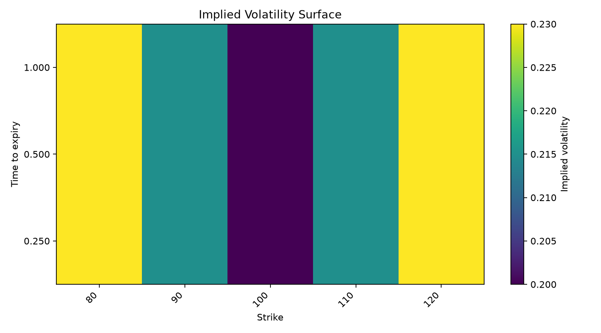
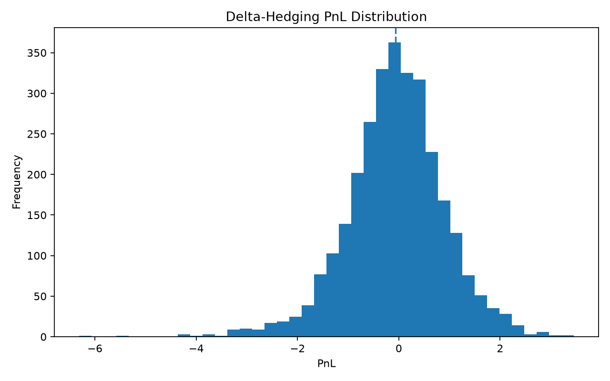
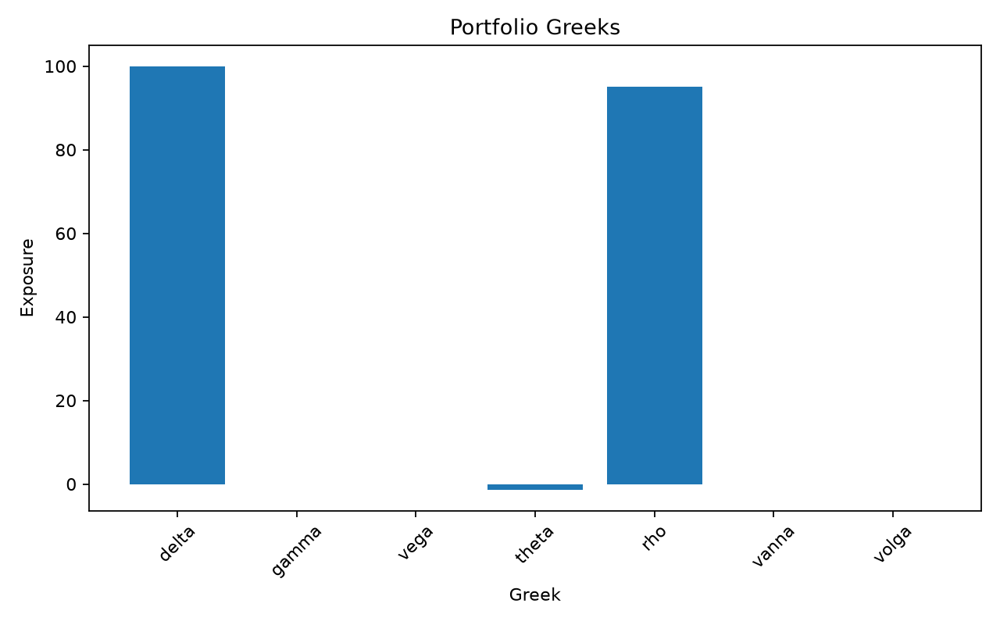

# options-risk-engine

A Python engine for option pricing, implied-volatility surface construction,
portfolio Greek aggregation, and delta-hedging simulation.

The project is designed as a clean quantitative-finance engineering sample:
small modules, typed data containers, deterministic tests, and a runnable
end-to-end pipeline.

## Features

- Black-Scholes European option pricing
- Full Greek output: delta, gamma, vega, theta, rho, vanna, volga
- Cox-Ross-Rubinstein binomial tree pricing
- American and European exercise support
- Monte Carlo European option pricing with antithetic variates
- Implied-volatility solver using Brent root finding
- Yahoo Finance option-chain normalization
- Implied-volatility surface construction
- Portfolio-level value and Greek aggregation
- Scenario revaluation PnL
- Discrete delta-hedging backtest
- Pytest test suite and GitHub Actions CI

## Project structure

    src/options_risk_engine/
      pricing/            Black-Scholes, binomial, Monte Carlo, implied vol
      market_data/        Yahoo Finance option-chain adapter
      vol_surface/        IV point cloud and surface matrix builder
      risk/               Portfolio value and Greek aggregation
      hedging_backtest/   Discrete delta-hedging simulation

## Install

    git clone https://github.com/kaoruixv/options-risk-engine.git
    cd options-risk-engine
    uv venv .venv --python 3.12
    source .venv/bin/activate
    uv pip install -e ".[dev]"

## Run tests

    pytest -q

## Quickstart

    python examples/quickstart.py

Expected output includes prices from three engines, recovered implied
volatility, portfolio-level Greeks, and mean delta-hedging PnL.

## Build a volatility surface from Yahoo Finance

    python scripts/build_surface.py --symbol AAPL --spot 200 --rate 0.04

This writes CSV outputs to results/:

- AAPL_iv_points.csv
- AAPL_rejected_quotes.csv
- AAPL_surface_matrix.csv

You can also restrict expiries:

    python scripts/build_surface.py --symbol AAPL --spot 200 --rate 0.04 --expiries 2026-08-21,2026-09-18

## Example: pricing

    from options_risk_engine.pricing import black_scholes

    result = black_scholes(
        S=100.0,
        K=100.0,
        T=1.0,
        r=0.05,
        sigma=0.20,
        option_type="call",
    )

    print(result.price)
    print(result.greeks.delta)

## Example: portfolio risk

    from options_risk_engine.risk import OptionPosition, aggregate_portfolio_risk

    positions = [
        OptionPosition("AAPL", "call", 1, 200.0, 210.0, 0.5, 0.04, 0.25),
        OptionPosition("AAPL", "put", -1, 200.0, 190.0, 0.5, 0.04, 0.28),
    ]

    risk = aggregate_portfolio_risk(positions)
    print(risk.total_value)
    print(risk.greeks.delta)

## Engineering notes

- No API keys are hardcoded.
- All tests use deterministic seeds or fake data adapters.
- Live Yahoo Finance access is isolated in the market_data module.
- Quote cleaning and implied-volatility inversion are separated.
- The portfolio layer is model-agnostic after individual positions are priced.

## Disclaimer

This repository is for research and engineering demonstration only.
It is not financial advice and should not be used for live trading without
independent validation.

## Example outputs

Volatility surface heatmap:

Delta-hedging PnL distribution:

Portfolio Greeks:

## Visualization examples

Generate demo charts:

    python examples/visualizations.py

This writes three PNG files to results/:

- demo_vol_surface_heatmap.png
- demo_hedging_pnl_histogram.png
- demo_portfolio_greeks.png

The visualization module supports:

- implied-volatility surface heatmaps
- delta-hedging PnL histograms
- portfolio Greeks bar charts

## References

The models implemented here are standard results from the derivatives
pricing literature, not original research. Credited here rather than
left implicit:

- Black, F., & Scholes, M. (1973). *The Pricing of Options and Corporate
  Liabilities.* Journal of Political Economy, 81(3), 637–654.
- Merton, R. C. (1973). *Theory of Rational Option Pricing.* Bell Journal
  of Economics and Management Science, 4(1), 141–183. (continuous
  dividend yield extension)
- Cox, J. C., Ross, S. A., & Rubinstein, M. (1979). *Option Pricing: A
  Simplified Approach.* Journal of Financial Economics, 7(3), 229–263.
  (CRR binomial tree)
- Brent, R. P. (1973). *Algorithms for Minimization Without Derivatives.*
  Prentice-Hall. (root-finding method used for implied-volatility
  inversion, via `scipy.optimize.brentq`)
- Hull, J. C. *Options, Futures, and Other Derivatives.* Pearson.
  (Greek scaling conventions and delta-hedging mechanics used throughout)
  
## Development note

This repository was built with AI-assisted development, including GPT-5.6,
for code scaffolding, debugging, documentation drafting, and test iteration.

The implementation is not presented as manually written line-by-line from
scratch. The project is presented as an engineering sample showing how to
design, test, validate, and package a quantitative-finance Python library
with clear modules and reproducible checks.
